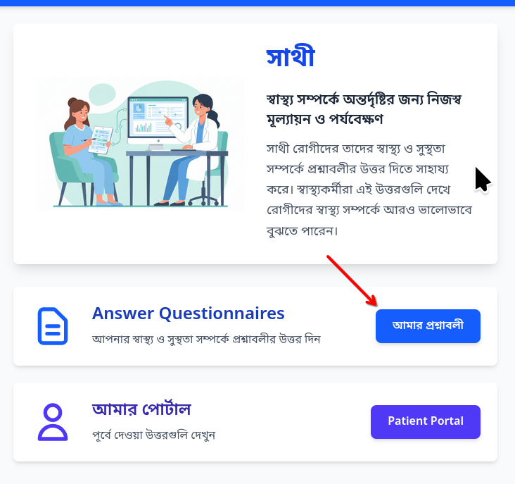
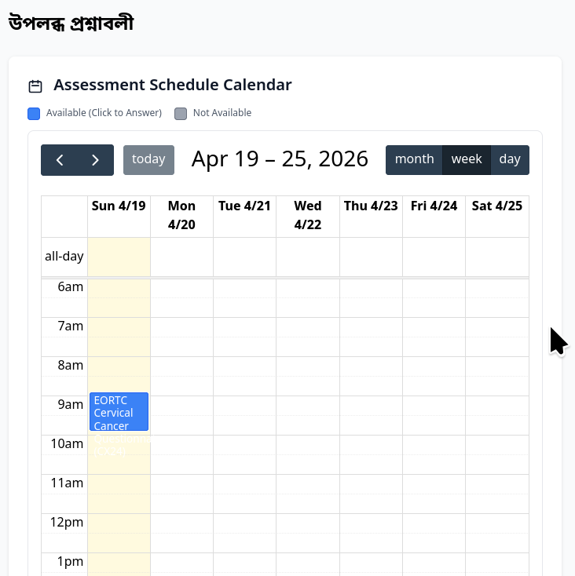
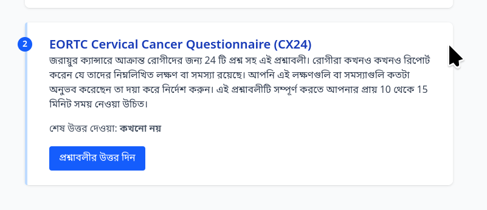
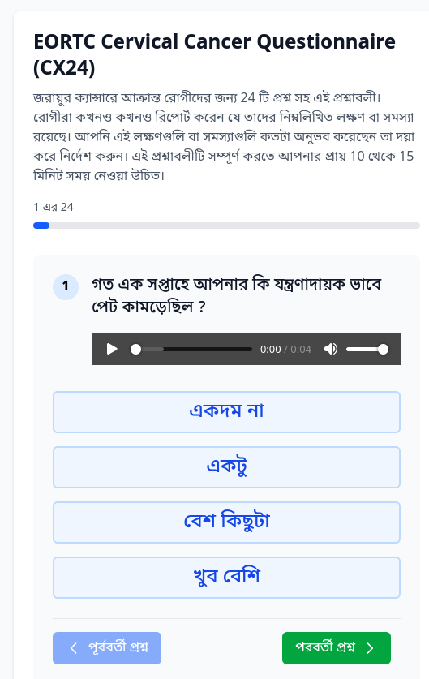
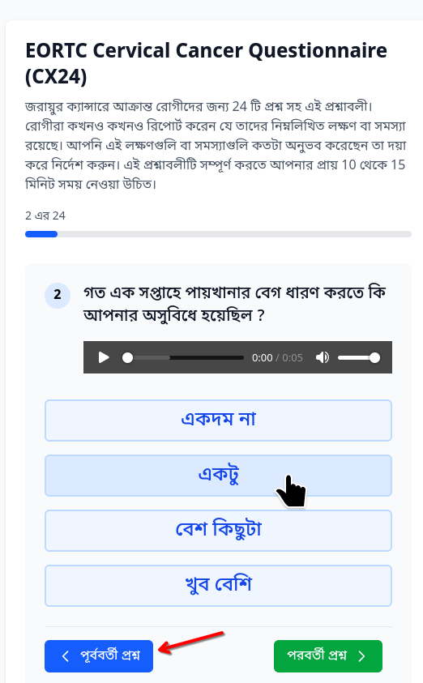
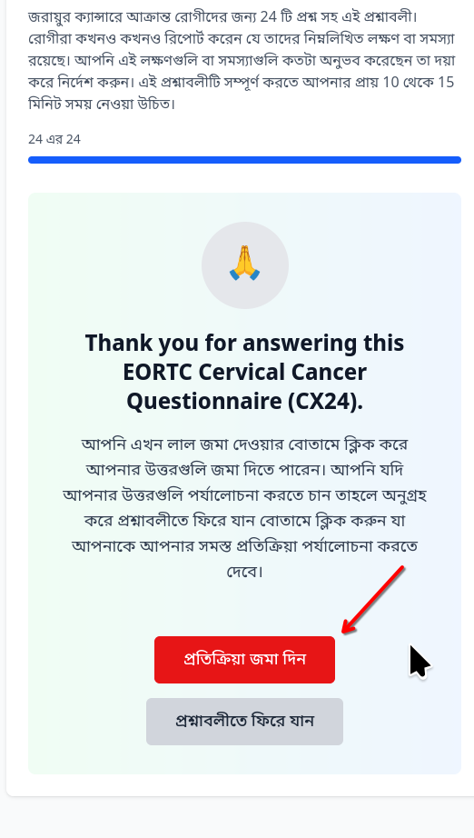
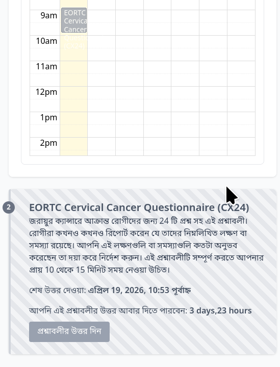

Answering Questions
==========================

Viewing questionnaires that can be answered
---------------------------------------------

The healthcare team in charge of your care will setup the questionnaires that you have to answer. After you have logged into the application you will can go to the page where the questionnaires are seen by clicking on the button titled "Answer Questions" on the main page. 

After you click on the button you will see a new page open where a calendar will be shown along with the links to answer questionnaires. In the following image we can see the patient has one questionnaire available for answering today. Today's date is indicated by the yellow color shading. 

You can click on the questionnaire name indicated by the blue button or scroll down to view the questionnaire which can be answered also. Click on the blue button to answer the questionnaire

Answering questionnaires
----------------------------

When you click the blue button noted above, the questionnaire page will open where the first question will be shown. THis will be shown in your preferred language, for example in this screenshot, we can see that the question is shown in the Bengali language. In addition to the question, you will also see that there is a audio player which allows you to hear the question in the language of your preference. This feature is useful if you are not comfortable with reading the question in your preferred language. 

Most commonly you will see three or four choices which you can select by pressing the appropriate button on the screen to provide your answer. However in some questions you may be asked to type in a text answer or select a number using a slider or record an audio / video clip. 

When you click an answer button the next question will be shown automatically. If you wish to go back to the previous question you can click the Blue color button "Previous Question" (shown in the screenshot in the Bengali language) and change your answer. If you wish to skip answering a question you can click on the green color "Next Question" button. 

Once all questions have been answered you will see a Thank you page, click on the Red Button to save your answers. 

After the questionnaire is submitted, the system will take you back to the My Questionnaires page where you can see the available questionnaires again. As shown in the screenshot below, based on the configuration, some questionnaires will be available for repeat answering after a certain period of time only.

In the screenshot above, the questionnaire will be available for answering after 4 days. 

