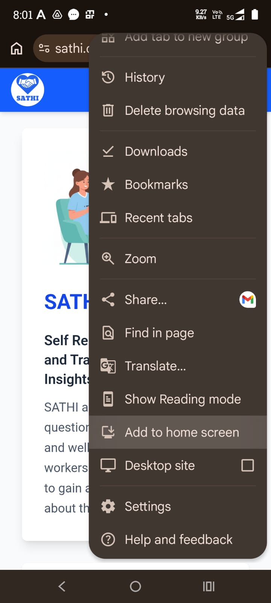
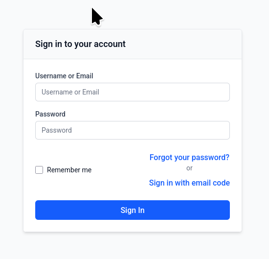
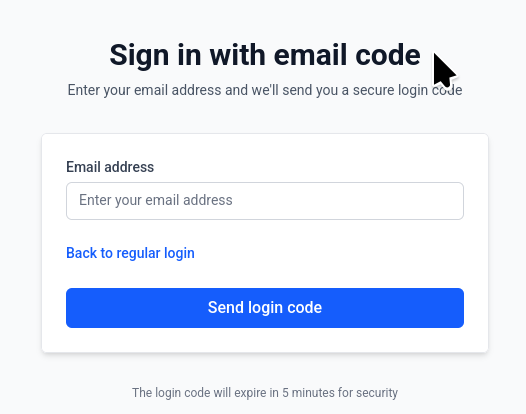
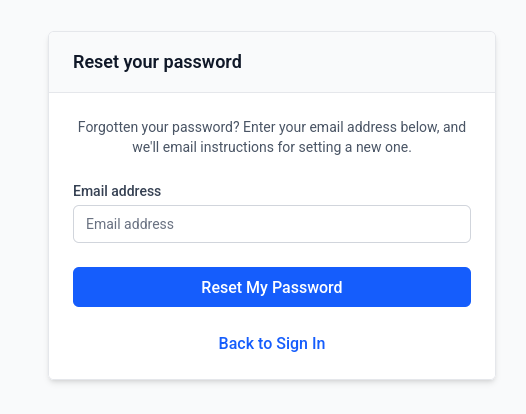

Getting Started
==========================

.. contents:: Table of Contents
   :local:
   :depth: 2

This guide will help you get started with using SATHI as a patient.

Overview
~~~~~~~~~~~~~~~~~~~~~~~~~~~~~~~~~~~~~~~~~~~~~~~~~~~~~

SATHI allows you to complete questionnaires about your health and well-being. Your responses help your healthcare team understand your condition and provide better care. You can answer these questionnaires using your computer / mobile phone / tablet. 

Accessing SATHI
~~~~~~~~~~~~~~~~~~~~~~~~~~~~~~~~~~~~~~~~~~~~~~~~~~~~~

To access SATHI please use the following link: https://sathi.chavi.ai. Alterantively you can scan the following QR code to access the application:

Application Installation
~~~~~~~~~~~~~~~~~~~~~~~~~~~~~~~~~~~~~~~~~~~~~~~~~~~~~

SATHI is a website which can be acccessed over the browser like any other website like Google, Facebook etc. However you caninstall the application in your mobile phone, desktop or tablet. This allows you to access the website easily. 

When you visit the website (https://sathi.chavi.ai) on a mobile browser, please click the three dots in the top right corner and you will be able to see a setting to add app to the home screen in Google Chrome. Click this to install the application on the mobile phone (see the screenshot below).

Registration
~~~~~~~~~~~~~~~~~~~~~~~~~~~~~~~~~~~~~~~~~~~~~~~~~~~~~

Registration in the SATHI application will be done by the healthcare staff in the hospital. They will ask you some basic questions for the registration like: 

#. The username and email ID you would prefer for the registration.  
#. Age 
#. Gender  
#. Date of registration in the hospital 
#. Preferred language 

The staff will ask you about your preferred language such that the questionnaires are displayed in the language that you prefer. Once the preferred language has been setup, the interface will show that language when you log in. 

Login (Password Based)
~~~~~~~~~~~~~~~~~~~~~~~~~~~~~~~~~~~~~~~~~~~~~~~~~~~~~

To login to the poprtal please click on the link to login on the Navigation bar on the top. Alternatively you can visit the login page at https://sathi.chavi.ai/login . In order to login you must provide an username or the registered email address along with the password. 

Email Code Login
~~~~~~~~~~~~~~~~~~~~~~~~~~~~~~~~~~~~~~~~~~~~~~~~~~~~~

An alternative mechanism is to request a one-time code via email. You can click the "Signin using Email code" to request a code to the registered email ID. Please note if the email is not registered, email will not be sent. If you do not receive the mail in 5 minutes, please check your spam folder.

Resetting your password 
~~~~~~~~~~~~~~~~~~~~~~~~~~~~~~~~~~~~~~~~~~~~~~~~~~~~~

If you have forgotten your password click the "Forgot your password" link. In the form that appears, please enter your registered email ID. Please check this email ID for a reset password link which when clicked will enable you to reset your password. 

 
