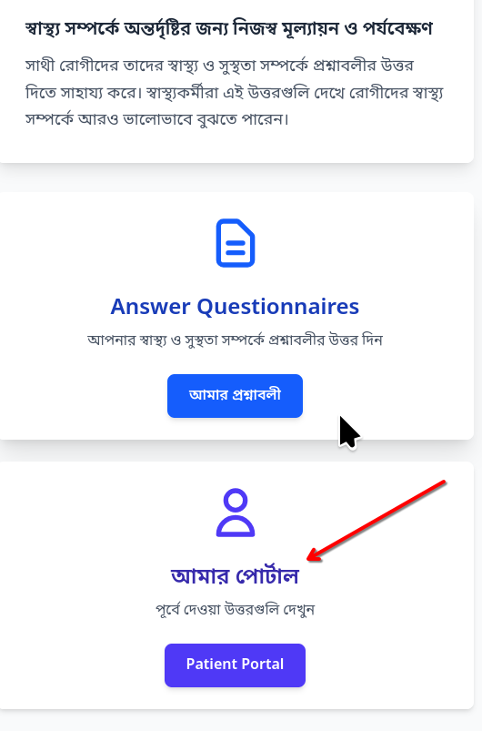

Viewing Your Results
=====================

The patient portal has been designed to allow you to view the answers you have provided for the questionnaires yourself. This page shows all the answers you have provided and shows plots of your responses over a period of time.

To access the patient portal, please click the "Patient Portal" button on the home page after logging in. 

When you access the patient portal you will see individual plots for question you have answered over a period of time. This shows how your problems have increased or decreased. It can help you to understand your health issues better and discuss these with your healthcare providers better. 

