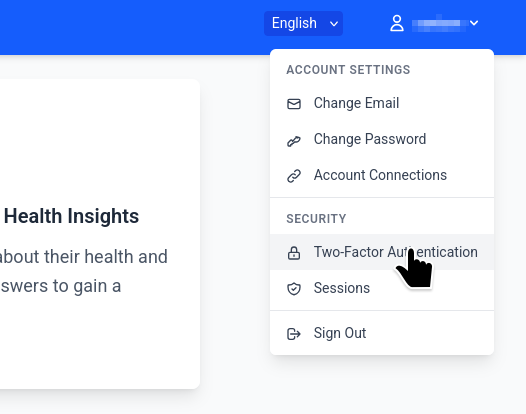
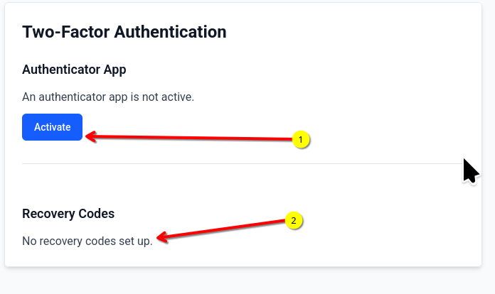
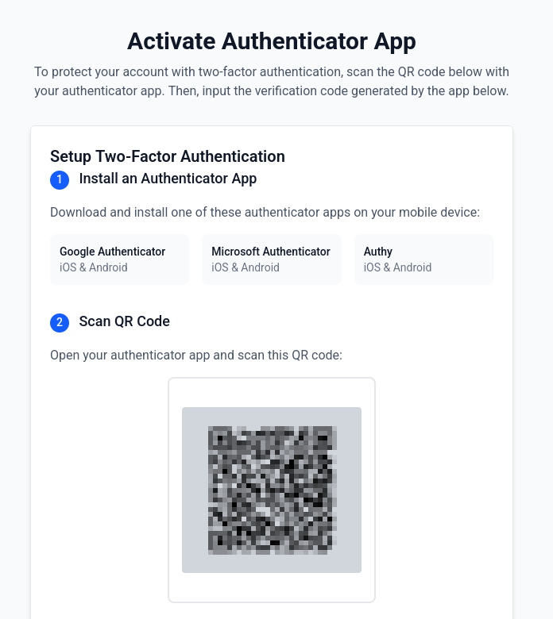
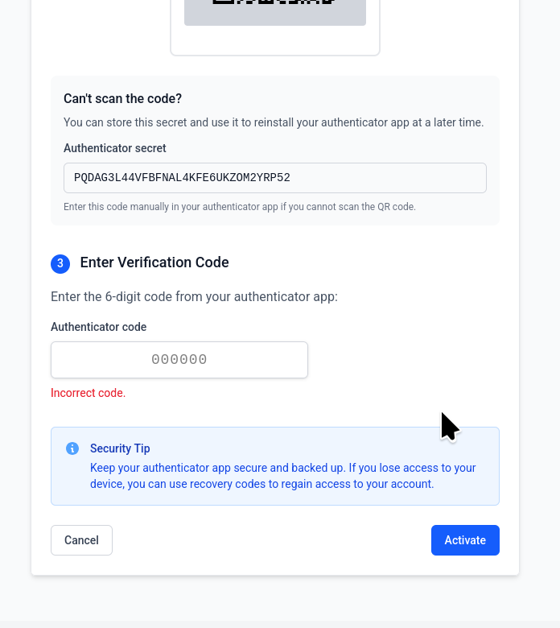
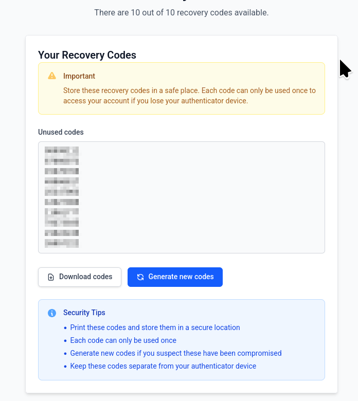
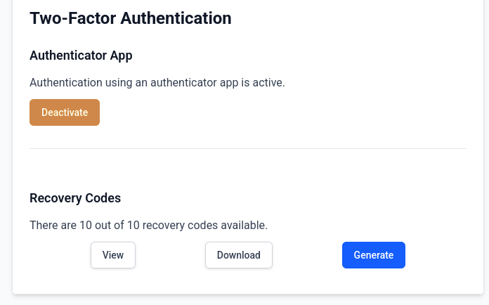

Two Factor Authentication 
==============================

.. contents:: Table of Contents
   :local:
   :depth: 2

The system supports and recommends two-factor authentication for additional security. Two factor authentication allows you to use another password which is separate from the usual password and can be generated on the fly such that an hacker cannot access your account even if they know the password. In order to set up this two-factor authentication you will need access to a Timed One Time Password (TOTP) application on your mobile phone. Some popular options are Google Authenticator (Android/iOS), Authy (Android/iOS), Microsoft Authenticator (Android/iOS) etc. 

To setup two factor authentication, first log in to the portal. After logging in, please navigate to the top left where your username appears. Click on the dropdown and it will show a menu where the settings for two-factor authentication can be accessed.

When you access the page for the first time you will be able to see a page with a button called "Activate" which will enable you to start the wizard for setting up two-factor authentication. Additionally you will be able to see that no recovery codes have been setup for your account. 

Click the Activate button to open the next page which will allow you to start setting up two-factor-authentication for. Please keep your authenticator application ready for this step. 

You will need to scan the QR code shown in the authenticator application and enter the 6 digit code in the form. Once this is done your two factor authentication is setup.

Before exiting it will be important to save a set of backup codes which will allow you to login to the system in case you loose access to the authenticator application. These backup codes should be stored securely as they can be used to login to the application. 

Note that once the two-factor authentication is activated, you will be required to enter the code from your authenticator application the first time you login to the application. You may choose to remember the browser for 2 weeks which will allow you to login to the application for two weeks without entering the two-factor-authentication codes in the same browser. 

After the two-factor authentication has been activated, the page will show that the two-factor authentication has been enabled. It also allows you to view, download and regenerate a new set of backup codes. 

